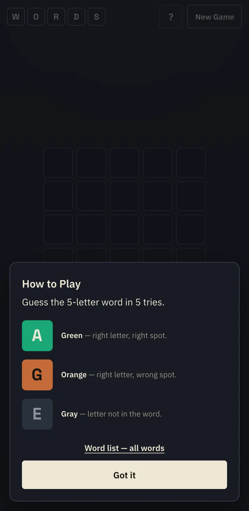
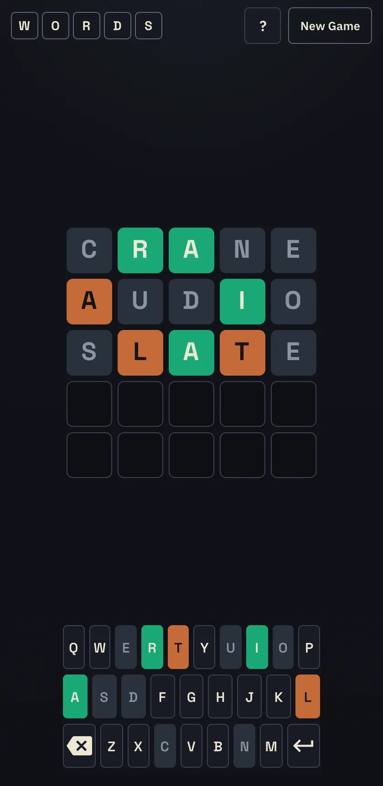

# WORDS

A browser word game: guess the secret **5-letter word** in **5 tries**.
English Wordle-style play with a QWERTY keyboard and a local word list.

## Screenshots

### Onboarding



### Gameplay



## How to play

1. Enter a 5-letter word and press Enter.
2. Colors tell you:
   - **green** — letter is correct and in the right spot;
   - **orange** — letter is in the word, wrong spot;
   - **gray** — letter is not in the word.
3. Solve it in 5 tries, or start a new game.

There is also a **Word list** page (linked from Help) with OTP-style pattern search, e.g. `A_E__`.

## Stack

| Layer      | Tech                                                                                                                               |
| ---------- | ---------------------------------------------------------------------------------------------------------------------------------- |
| UI         | HTML5, CSS3 (no preprocessors)                                                                                                     |
| Logic      | Vanilla JavaScript (IIFEs on `window`)                                                                                             |
| Dictionary | Local list of 5-letter words (`solutions` ⊆ `validGuesses`)                                                                        |
| Fonts      | [IBM Plex Sans](https://fonts.google.com/specimen/IBM+Plex+Sans), [Space Grotesk](https://fonts.google.com/specimen/Space+Grotesk) |
| Hosting    | GitHub Pages (static, no build)                                                                                                    |

No dependencies and no bundler: open `index.html` and play.

### Layout

```
index.html      # shell + how-to-play
words.html      # dictionary + pattern search
css/styles.css  # theme & motion
js/words.js     # dictionary
js/game.js      # pure game logic (no DOM)
js/ui.js        # DOM, input, animations
js/words-page.js
js/main.js      # boot
```

## Run locally

```bash
open index.html
```

or any static server from the repo root:

```bash
python3 -m http.server 8080
# http://127.0.0.1:8080/
```

## Online

Published on GitHub Pages:

**https://askomarov.github.io/wordle-en/**

## License

Free to use and modify within this repository.
